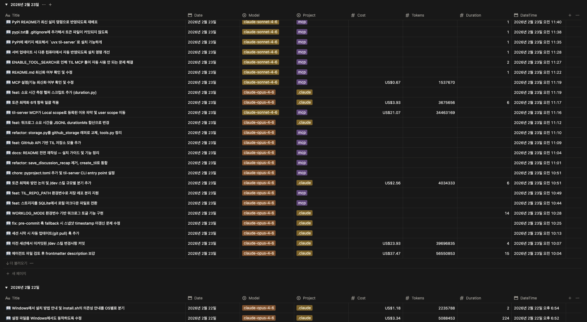

<p align="center">
  <h1 align="center">ai-worklog</h1>
  <p align="center">
    Automatic work logging for <a href="https://claude.com/claude-code">Claude Code</a> sessions
    <br />
    Track what you built, how long it took, and what it cost — on every commit.
  </p>
</p>

<p align="center">
  <a href="https://github.com/kangraemin/ai-worklog/blob/main/LICENSE"></a>
  <a href="https://github.com/kangraemin/ai-worklog/issues"></a>
  <a href="https://github.com/kangraemin/ai-worklog/stargazers"></a>
</p>

<p align="center">
  
</p>

---

## Why ai-worklog?

When you're deep in a Claude Code session, it's easy to lose track of what you've done. ai-worklog captures everything automatically:

- **What** changed — AI-generated summaries of each commit
- **How long** — Actual Claude processing time, not wall-clock time
- **How much** — Token usage and cost delta per work session

No manual note-taking. No forgetting to log. Just commit and it's done.

## Features

- **Zero-friction logging** — Post-commit hook writes entries automatically
- **Notion sync** — Optional real-time sync to a Notion database
- **Token & cost tracking** — Parses Claude Code JSONL to calculate deltas
- **Duration tracking** — Measures actual Claude work time per session
- **Flexible storage** — Local markdown, Notion, or both
- **Bilingual** — Korean and English support
- **Non-destructive install** — Preserves existing git hooks via chaining
- **Self-updating** — Built-in version check with `/update-worklog`

## Quick Start

```bash
git clone https://github.com/kangraemin/ai-worklog.git
cd ai-worklog
./install.sh
```

The interactive wizard walks you through:

1. **Language** — Korean or English
2. **Scope** — Global (`~/.claude/`) or project-local (`.claude/`)
3. **Storage** — Markdown files, Notion, or both
4. **Timing** — Automatic on each commit or manual only
5. **Auto-commit** — Optionally commit uncommitted changes when Claude stops

That's it. Start committing and worklogs appear automatically.

## How It Works

```
git commit
  └─ post-commit hook
       └─ claude -p  →  AI-generated summary
            └─ worklog-write.sh
                 ├─ token-cost.py   →  cost delta from JSONL
                 ├─ duration.py     →  work time from JSONL
                 ├─ .worklogs/YYYY-MM-DD.md  (local)
                 └─ notion-worklog.sh        (optional)
```

Works with any commit method — direct `git commit`, Claude Code `/commit` skill, or auto-commit via Stop hook.

## Usage

### Automatic (default)

Every `git commit` triggers a worklog entry. No action required.

### Manual

```
/worklog
```

Writes a worklog entry from the current conversation context.

### Session finish

```
/finish
```

Commits uncommitted changes, pushes, and writes a worklog — all in one step.

### Migrate existing worklogs to Notion

```
/migrate-worklogs              # dry-run preview
/migrate-worklogs --all        # migrate all .md files
/migrate-worklogs --date 2026-03-01  # specific date only
```

### Update

```
/update-worklog
```

## Entry Format

```markdown
## 14:30

### Request
- Add duplicate prevention to migration script

### Summary
- Added .migrated fingerprint file to skip already-sent entries
- Updated skipped count in output summary

### Changed Files
- `scripts/notion-migrate-worklogs.sh`: duplicate prevention logic

### Token Usage
- Model: claude-sonnet-4-6
- This session: $1.089
```

> Section headers follow `WORKLOG_LANG` — Korean (`ko`) or English (`en`).

## Configuration

All settings live in `settings.json` under `env`:

| Variable | Values | Default | Description |
|---|---|---|---|
| `WORKLOG_TIMING` | `each-commit` \| `manual` | `each-commit` | When to write worklogs |
| `WORKLOG_DEST` | `git` \| `notion` \| `notion-only` | `git` | Where to store worklogs |
| `WORKLOG_GIT_TRACK` | `true` \| `false` | `true` | Track `.worklogs/` in git |
| `WORKLOG_LANG` | `ko` \| `en` | `ko` | Entry language |
| `NOTION_DB_ID` | UUID | — | Notion database ID |

### Storage Modes

| Mode | DEST | GIT_TRACK | What happens |
|---|---|---|---|
| **git** | `git` | `true` | Markdown files, committed with your code |
| **git-ignore** | `git` | `false` | Markdown files, git-ignored |
| **both** | `notion` | `true` | Markdown + Notion sync |
| **notion-only** | `notion-only` | `false` | Notion only, no local files |

### Notion Setup

1. Create an integration at [notion.so/my-integrations](https://www.notion.so/my-integrations)
2. Add `NOTION_TOKEN=secret_...` to `~/.claude/.env`
3. Run `./install.sh` — the wizard auto-creates the database

**Database schema:**

| Column | Type | Description |
|---|---|---|
| Title | title | One-line work summary |
| Date | date | Work date |
| DateTime | date | Precise timestamp (for sorting) |
| Project | select | Repository name |
| Cost | number | Cost delta ($) |
| Tokens | number | Token delta |
| Duration | number | Claude work time (minutes) |
| Model | select | Claude model used |

## Architecture

### Hooks

| Event | File | Description |
|---|---|---|
| git `post-commit` | `hooks/post-commit.sh` | Generates worklog entry on each commit |
| `PostToolUse` | `hooks/worklog.sh` | Collects tool usage into per-session JSONL |
| `SessionEnd` | `hooks/session-end.sh` | Cleans up JSONL collection file |
| `Stop` | `hooks/stop.sh` | Prompts to commit uncommitted changes |

### Scripts

| File | Description |
|---|---|
| `scripts/worklog-write.sh` | Core writer — file + Notion + snapshot |
| `scripts/token-cost.py` | Token/cost delta calculator from JSONL |
| `scripts/duration.py` | Work duration calculator from JSONL |
| `scripts/notion-worklog.sh` | Notion API page creation |
| `scripts/notion-migrate-worklogs.sh` | Bulk `.md` → Notion migration |
| `scripts/update-check.sh` | Version check against remote |

### Commands

| Skill | Description |
|---|---|
| `/worklog` | Manual worklog entry from conversation context |
| `/finish` | Commit + push + worklog in one step |
| `/migrate-worklogs` | Migrate `.worklogs/` to Notion |
| `/update-worklog` | Check for updates and re-install |

### Directory Structure

```
ai-worklog/
├── install.sh              # Interactive installer
├── uninstall.sh            # Clean removal
├── hooks/                  # Claude Code lifecycle hooks
├── git-hooks/              # Git hook wrappers
├── scripts/                # Core execution scripts
├── commands/               # Claude Code skill definitions
├── rules/                  # Workspace rules
├── tests/                  # End-to-end test suite
└── docs/                   # Documentation assets
```

## Uninstall

```bash
./uninstall.sh
```

Removes hooks, scripts, and env vars. Preserves `.worklogs/` data and Notion credentials.

## Requirements

- [Claude Code](https://claude.com/claude-code) CLI
- `python3`
- `curl`
- `jq`

## Contributing

Contributions are welcome! Feel free to:

1. Fork the repository
2. Create a feature branch (`git checkout -b feature/amazing-feature`)
3. Commit your changes
4. Push to the branch
5. Open a Pull Request

## License

Distributed under the MIT License. See [LICENSE](LICENSE) for details.

---

<p align="center">
  Built for <a href="https://claude.com/claude-code">Claude Code</a> by <a href="https://github.com/kangraemin">@kangraemin</a>
</p>
